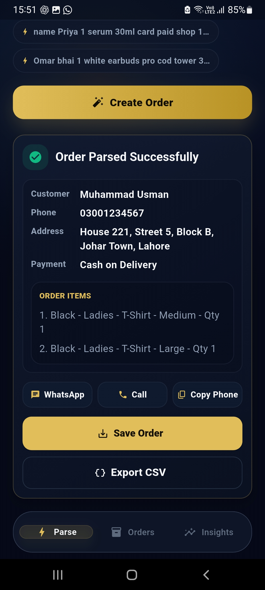
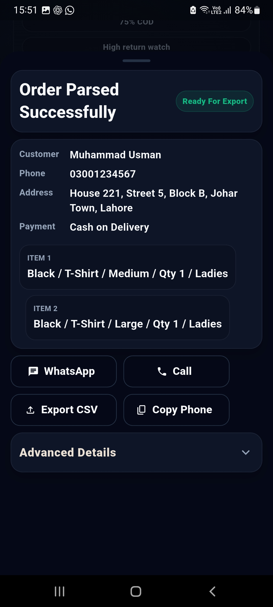
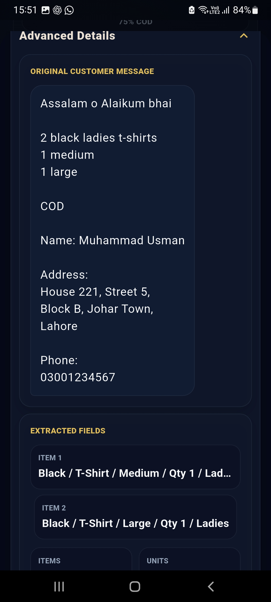
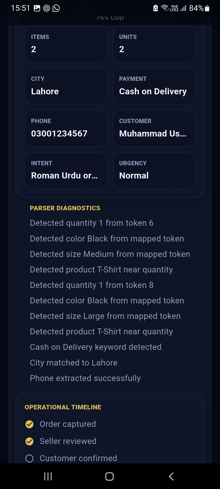

# ParseFlow

AI-powered WhatsApp Order Parser for E-commerce Sellers.

## Problem

Thousands of sellers receive orders through WhatsApp every day.

These orders are often written in Roman Urdu, mixed English, and unstructured formats, making fulfillment slow and error-prone.

Example:

"1 white medium shirt, 1 black small shirt COD Lahore"

## Solution

ParseFlow converts messy WhatsApp orders into structured fulfillment-ready records automatically.

## Features

- Multi-item order extraction
- Roman Urdu parsing
- Size and color detection
- Customer phone extraction
- Delivery address parsing
- COD detection
- CSV export
- Seller operations dashboard

## Target Users

- Shopify sellers
- Facebook sellers
- WhatsApp-first businesses
- Small e-commerce stores

## Example Output

Input:

1 white medium shirt, 1 black small shirt COD Lahore

Output:

- Product 1: White Shirt (Medium)
- Product 2: Black Shirt (Small)
- Payment: COD
- City: Lahore

## Status

Demo MVP

Currently seeking:
- Beta users
- Feedback
- Strategic partners
- Acquisition discussions

## Founder

Rana Amir
## Live Demo
# ParseFlow

AI-powered WhatsApp Order Parser for E-commerce Sellers.

## Live Demo

🎥 Watch Demo:
https://youtube.com/shorts/aYL2UNYPJwo?si=baMDBRXgNS88sGZ8

## Screenshots

### Parse Screen

### Order Details

### Orders Dashboard

### Export Flow

### Analytics

